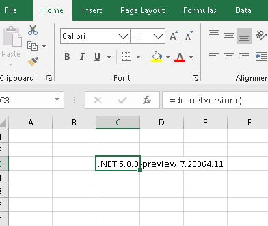

# **XLW 20**
xlw is being updated.

This repo was originally forked from [John's XLW repo](https://github.com/JohnAdders/xlw) which itself was imported from it's original home at [SourceForge](https://sourceforge.net/projects/xlw/)


This version will only support Visual Studio 2019. In this fork all support for previous Visual Studio versions has been dropped. All support for gcc has also been dropped.\
Support is being added for building xlls against .NET CORE & .NET Framework 4.7.2 simultaneously

Going forward the target of the  project will be to produce two nuget packages. One for building native xlls and one for building C# xlls targeting .NET Framework 4.7.2, .NET 5 and .NET Core 3.1

Currently the template projects have only be tested against 64bit Excel not 32bit.

## xlw
xlw for building C++/C xlls has not changed much at this point. There is one template project `xlw\xlw\Template_Projects\Template.sln`

## xlwDotNet
The Template xll (xlw\xlwDotNet\Template_Projects\VS16\Template.sln) has been compiled against .NET 5.0.0-preview7 , .NET Core 3.1 and .NET Framework 4.7.2. The resulting xlls open in Excel 2019 (64bit) and work as expected.


1. The VS Solution `xlw\xlw\xlw20.sln` will build xlw. The resulting libraries go to  `xlw\xlw\lib`

```
  lib -> 
      InterfaceGenerator.exe
      Win32 ->
            xlw-vc142-mt-6_0_0.lib
            xlw-vc142-mt-gd-6_0_0.lib
      x64   ->\
            xlw-vc142-mt-6_0_0.lib
            xlw-vc142-mt-gd-6_0_0.lib
```
2. The VS Solution  `xlw\xlwDotNet\xlwDotNet.sln` will build xlwDotNet (expecting xlw to have already been built).\
 Specifically the C# project `Builder` builds the main library and the main library should not be built explicitly. This is because Buidler configures the MSBuild properties for
 xlwDotNet to build.
 ```
  lib -> 
      Debug ->
            Win32 ->
                  net5.0 ->
                        xlwDotNet-vc142-mt-gd-6_0_0.dll
                        DotNetInterfaceGenerator.exe
                  net472 ->
                        xlwDotNet-vc142-mt-gd-6_0_0.dll
                        DotNetInterfaceGenerator.exe
                  netcoreapp3.1 ->
                        xlwDotNet-vc142-mt-gd-6_0_0.dll
                        DotNetInterfaceGenerator.exe
            x64 ->
                  net5.0 ->
                        xlwDotNet-vc142-mt-gd-6_0_0.dll
                        DotNetInterfaceGenerator.exe
                  net472 ->
                        xlwDotNet-vc142-mt-gd-6_0_0.dll
                        DotNetInterfaceGenerator.exe
                  netcoreapp3.1 ->
                        xlwDotNet-vc142-mt-gd-6_0_0.dll
                        DotNetInterfaceGenerator.exe
                       
      Release ->
            Win32 ->
                  net5.0 ->
                        xlwDotNet-vc142-mt-6_0_0.dll
                        DotNetInterfaceGenerator.exe
                  net472 ->
                        xlwDotNet-vc142-mt-6_0_0.dll
                        DotNetInterfaceGenerator.exe
                  netcoreapp3.1 ->
                        xlwDotNet-vc142-mt-6_0_0.dll
                        DotNetInterfaceGenerator.exe
            x64 ->
                  net5.0 ->
                        xlwDotNet-vc142-mt-6_0_0.dll
                        DotNetInterfaceGenerator.exe
                  net472 ->
                        xlwDotNet-vc142-mt-6_0_0.dll
                        DotNetInterfaceGenerator.exe
                  netcoreapp3.1 ->
                        xlwDotNet-vc142-mt-6_0_0.dll
                        DotNetInterfaceGenerator.exe
```

The  .NET Template project `\xlw\xlwDotNet\Template_Projects\VS16\Template.sln` is setup to build  xlls for .NET Framework 4.7.2 ,  .NET Core 3.1 and .NET 5.0.0
``` <PropertyGroup>
  <TargetFrameworks>net472;net5.0;netcoreapp3.1</TargetFrameworks>
    <Platforms>x64;x86</Platforms>
  </PropertyGroup>
```

~~To run the .NET 5 xll you have to add the directory containing the the xll to your Path (not so for the .NET Framework version). This needs to be fixed.
Seems like it's discussed [here](https://github.com/dotnet/runtime/issues/38231)~~ 

To run the .NET 5 & .NET Core 3.1  xlls you will need to rename XLL.runtimeconfig.json to Template.runtimeconfig.json in the target directory. This seems like an issue with VS and needs to be resolved.

The Template project exposes the following Excel function

```csharp
        [ExcelExport("Get's .NET Version")]
        public static String dotnetversion()
        {
            return System.Runtime.InteropServices.RuntimeInformation.FrameworkDescription;
        }
```


<sup>*Excel 2019</sup>

The output are:

| TargetFramework  | xll  | Output  |
| ------------- |:-------------:|:-------------:|
| net472        |xlw\xlwDotNet\Template_Projects\VS16\Addin\Debug\x64\net472\Template.xll |.NET Framework 4.8.4084.0 |
| netcoreapp3.1        |xlw\xlwDotNet\Template_Projects\VS16\Addin\Debug\x64\netcoreapp3.1\Template.xll |.NET Core 3.1.2|
| net5.0        |xlw\xlwDotNet\Template_Projects\VS16\Addin\Debug\x64\net5.0\Template.xll |.NET 5.0.0-preview.7.20364.11|


